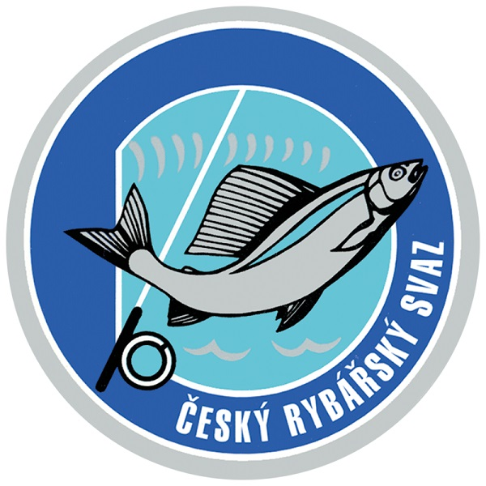
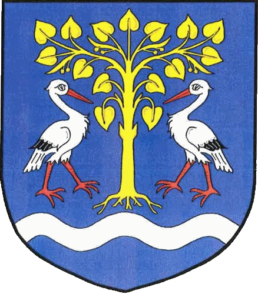

# 🎣 Rybářský Znalec: Kvíz a Atlas

 
 

## 📖 Popis projektu

Interaktivní webová aplikace vytvořená pro **MO Lípa nad Orlicí** s cílem zábavnou formou prověřit a prohloubit znalosti o českých rybách, jejich lovných mírách, dobách hájení a aktuálním Rybářském řádu. Aplikace je plně responzivní a optimalizovaná pro použití ve vzdělávání, na schůzích či v terénu.

---

## ✨ Klíčové funkce

* **🎣 Poznávačka ryb (Classic/Time Attack):** Kvíz s náhodně generovanými otázkami na identifikaci ryby z fotografie a na jejich základní parametry (délka, hájení). Podporuje bodový i časový režim.
* **📜 Znalec řádu:** Samostatný kvízový modul testující teoretické znalosti z Rybářského řádu (na základě dokumentu ČRS 2026/2027), s automatickým vysvětlením správné odpovědi.
* **⚙️ Nastavitelný kvíz:** Možnost zvolit vlastní počet otázek (až 50+).
* **🏆 Síň slávy:** Místní ukládání nejlepších výsledků pro všechny herní módy s rozdělením na Body, Čas a Znalost Řádu.
* **🔍 Atlas ryb:** Interaktivní seznam pro rychlé vyhledávání informací (míry, hájení) s možností zvětšení fotografií.
* **💾 Ukládání dat:** Všechny herní statistiky jsou lokálně uloženy v prohlížeči (`localStorage`).

---

## 💻 Technologie a spuštění

Projekt je postaven na čistých webových technologiích, bez externích knihoven.

| Technologie | Popis |
| :--- | :--- |
| **HTML5** | Struktura aplikace a navigace |
| **CSS3** | Stylování, responzivní design |
| **Vanilla JavaScript** | Herní logika, generování otázek, správa stavu, žebříčky |
| **JSON** | Databáze ryb (`data_ryby.json`) a otázek řádu (`data_rad.json`) |

### Lokální spuštění

1.  Naklonujte nebo stáhněte celý repozitář.
2.  Ujistěte se, že máte zachovanou strukturu složek (`data/`, `assets/images/`).
3.  Otevřete `index.html` v prohlížeči, ideálně pomocí **Live Serveru** (doplněk VS Code) nebo jiného lokálního webového serveru pro správné načtení JSON souborů.

---

## 🤝 Partneři a Autoři

Tato aplikace byla vytvořena pro:

### **MO Lípa nad Orlicí**

**Za podpory partnerů:**

    
    &nbsp;&nbsp;&nbsp;
    
    &nbsp;&nbsp;&nbsp;
    

***

**Autor kódu:** Generováno AI asistentem na základě zadání (Prosinec 2025).
