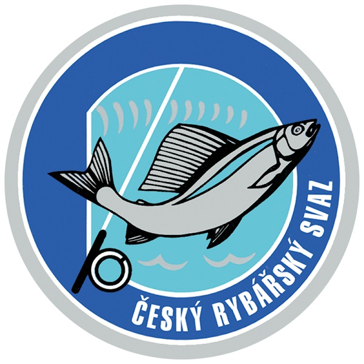
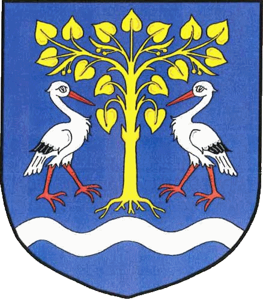

# 🎣 Rybářský Znalec: Kvíz a Atlas

 
 
 

- https://silajiri.github.io/molipa/
- https://csvjson.com/csv2json

## 📖 Popis projektu

Interaktivní webová aplikace vytvořená pro **MO Lípa nad Orlicí** s cílem prověřit znalosti o českých rybách a Rybářském řádu. Aplikace přešla z lokálního ukládání na **centralizovaný systém skóre (Firebase)**, což umožňuje sdílený žebříček pro všechny hráče.

---
## ✨ Klíčové funkce

* **🌐 Centralizovaný Žebříček:** Výsledky jsou ukládány v databázi **Firebase Firestore**, díky čemuž jsou žebříčky sdílené a konzistentní pro všechny uživatele na jakémkoliv zařízení.
* **🎣 Kvíz na body:** Mix otázek – poznávání ryb z fotografie i znalost jejich parametrů (délka, hájení).
* **⏱️ Kvíz na čas:** Stejný mix otázek jako Kvíz na body, ale hodnotí se celkový čas dokončení.
* **🐠 Poznávačka:** Výhradně fotografie ryb – hráč identifikuje rybu z nabízených čtyř možností. Určeno k tréninku vizuálního rozpoznávání.
* **📜 Znalec řádu:** Samostatný kvízový modul testující teoretické znalosti z Rybářského řádu s automatickým vysvětlením správné odpovědi.
* **⚙️ Flexibilní nastavení:** Možnost zvolit vlastní počet otázek (až 50+).
* **🔍 Atlas s detailními informacemi:** Seznam ryb, jejich míry a hájení s možností zvětšení fotografií.
* **📱 Optimalizace pro mobil:** Kompaktní rozvržení zajišťuje přehledné zobrazení celého kvízu bez nutnosti rolování.

---
## 💻 Technologie a Spuštění

Projekt je postaven na moderních statických technologiích s externím datovým úložištěm.

| Technologie | Role |
| :--- | :--- |
| **HTML/CSS/Vanilla JS** | Frontend, aplikační logika |
| **Firebase Firestore** | Centralizovaná databáze pro ukládání skóre |
| **JSON** | Statická databáze obsahu (`data_ryby.json`, `data_rad.json`) |

### Lokální spuštění

Pro lokální testování je nezbytné splnit následující kroky:

1.  **Struktura:** Zachovejte strukturu složek (`data/`, `assets/images/`).
2.  **Konfigurace klíčů:** Vytvořte v hlavní složce soubor **`config.js`** s vaší Firebase konfigurací (API klíče). *Tento soubor by neměl být nahrán na GitHub!*
3.  **Spuštění:** Spusťte `index.html` pomocí **Live Serveru** (nebo jiného lokálního webového serveru), aby se správně načetly JSON soubory a navázalo se připojení k Firebase.

---
## 🛡️ Bezpečnost Dat

Bezpečnost žebříčku je zajištěna následujícími mechanismy, přestože je API klíč veřejný:

1.  **Firebase Security Rules:** Pravidla databáze povolují pouze **čtení** (pro zobrazení žebříčku) a **vytváření** (nový záznam skóre), ale zakazují mazání nebo přepisování starých výsledků.
2.  **Google Cloud API Restrictions:** Klíč je omezen pouze na doménu **`github.io`** a lokální IP adresu (`127.0.0.1`), čímž je zneužití klíče na cizích webech minimalizováno.

---
## 🤝 Partneři a Autoři

Tato aplikace byla vytvořena pro:

### **MO Lípa nad Orlicí**

    
    &nbsp;&nbsp;&nbsp;
    
    &nbsp;&nbsp;&nbsp;
    

***

**Autor kódu:** Generováno AI asistentem na základě zadání (Prosinec 2025 – Březen 2026).
